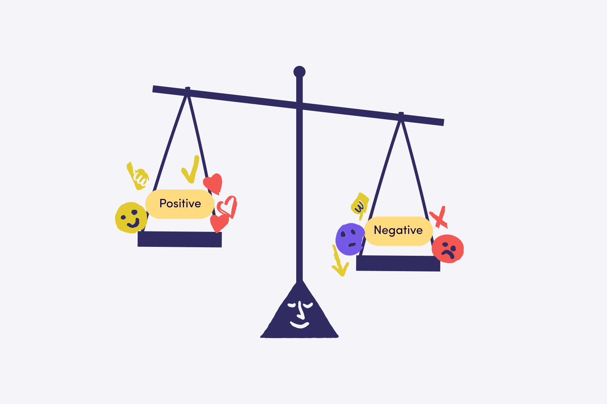
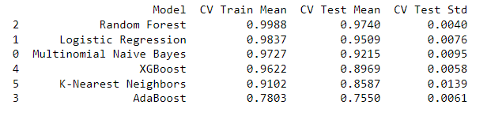
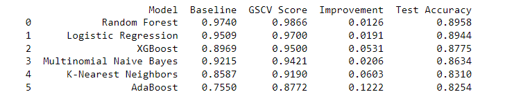
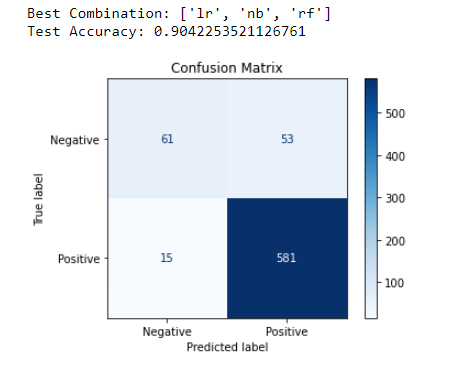
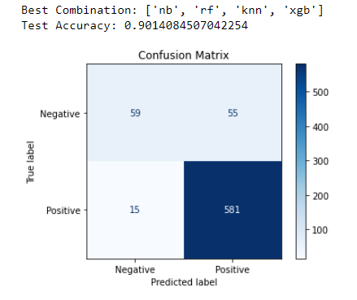

# Twitter Sentiment Analysis

**Authors**: David Johnson

## Overview

This project aims to construct and assess machine learning models for sentiment analysis on Twitter data, involving the collection, preprocessing, and transformation of text data to facilitate classification into positive or negative sentiment categories. Various models including Naive Bayes, Logistic Regression, Random Forest, AdaBoost, XGBoost, and K-Nearest Neighbors are trained on preprocessed data using techniques such as pipeline construction and hyperparameter tuning. Ensemble learning methods like the Voting Classifier are explored to amalgamate predictions from multiple models for enhanced accuracy and performance evaluation metrics. Emphasizing best practices in machine learning, the project strives to develop a dependable sentiment analysis model capable of discerning public opinion and sentiment trends from Twitter data.



## Business Problem

In today's digital age, companies and brands are increasingly leveraging social media platforms such as Twitter to connect with their audience, build brand loyalty, and monitor public sentiment. However, analyzing the vast amount of user-generated content on Twitter to gauge public opinion manually can be time-consuming and inefficient. Therefore, the business problem we aim to address with this project is the need for an automated sentiment analysis solution that accurately classifies tweets as either positive or negative. By automating the sentiment analysis process, companies can gain valuable insights into customer perceptions, identify emerging trends, and tailor their marketing strategies to better resonate with their target audience.

The stakeholders who could benefit from this project include marketing professionals, brand managers, social media analysts, and business decision-makers. Marketing professionals can use the sentiment analysis tool to gauge the effectiveness of their marketing campaigns in real-time and adjust their strategies accordingly. Brand managers can monitor brand perception and identify potential issues or crises before they escalate. Social media analysts can track public sentiment trends over time and identify key influencers or opinion leaders within their industry. Business decision-makers can use the insights gained from sentiment analysis to make informed decisions about product development, customer service improvements, and crisis management strategies. Ultimately, this project aims to provide a valuable tool for stakeholders to better understand and respond to public sentiment on Twitter, thereby enhancing brand reputation and driving business success.

## Data

The dataset used in this project was sourced from [CrowdFlower](https://data.world/crowdflower/brands-and-product-emotions). It comprises tweets about various brands and products, with contributors tasked to evaluate whether each tweet expresses a positive, negative, or neutral emotion towards a specific brand or product. The dataset contains a total of 9093 rows of data. For each tweet, the target brand or product of the expressed emotion is identified. Exploratory analysis of the dataset reveals that it provides a rich source of information for sentiment analysis, as it captures real-time opinions and emotions expressed by users on Twitter regarding different brands and products.

## NLP Preprocessing

In order to work with text data. There were numerous steps we had to take before running any of our models.
Below is a list of the steps we took:

1. Encoding Sentiment Labels
2. Handling Missing Values
3. Cleaning the Text Data (aka removing stop words, punctuation, URLs, special characters, numbers, and then applying lemmatization to reduce words to their base forms.
4. Text Vectorization

## Results

### Baseline Models

Multiple machine learning models were tested for sentiment analysis, including Multinomial Naive Bayes, Logistic Regression, Random Forest, AdaBoost, XGBoost, and K-Nearest Neighbors. The evaluation was conducted using default settings without hyperparameter tuning, serving as a baseline assessment of their performance. Results indicated that Random Forest achieved the highest mean accuracy at 97.40%. However, there were signs of slight overfitting, particularly noticeable in models like Multinomial Naive Bayes and Logistic Regression. This overfitting was expected due to class imbalance in the dataset, addressed through oversampling to mitigate bias toward the majority class. These findings provide initial insights into model performance and suggest areas for further optimization to improve generalization capabilities.



### Hyperparameter Tuning with GridSearchCV

GridSearchCV significantly improved the performance of all models by fine-tuning their hyperparameters. Before hyperparameter tuning, represented by the Baseline scores, the models achieved decent but not optimal performance, as indicated by their respective CV test mean scores. However, after applying GridSearchCV, denoted by the GSCV Score column, the models showed remarkable improvements in their training scores, highlighting the effectiveness of hyperparameter optimization. These improvements, quantified in the Improvement column, illustrate the extent to which each model's performance was enhanced. For instance, models like K-Nearest Neighbors and AdaBoost saw substantial improvements of 6.03% and 12.22%, respectively, suggesting a significant boost in predictive accuracy. Finally, the Test Accuracy column reflects the performance of the best-tuned model on unseen data (X_test), demonstrating the real-world applicability and effectiveness of the optimized models in accurately predicting sentiment from Twitter data.



### Ensemble Modeling

#### Hard Voting

The hard voting ensemble method, comprising logistic regression (lr), multinomial naive Bayes (nb), and random forest (rf) models, achieved a remarkable accuracy of 90.42% in sentiment analysis on Twitter data. This ensemble's success can be attributed to its ability to leverage the diverse strengths of individual models. Logistic regression excels in capturing linear relationships, while multinomial naive Bayes handles text data well due to its probabilistic nature. Random forest, on the other hand, harnesses the power of decision trees, providing robustness and handling nonlinear relationships effectively. By aggregating predictions from these complementary models, hard voting leverages the wisdom of crowds, mitigating individual model biases and errors. The resulting ensemble achieves superior performance by combining the predictive abilities of its constituent models, resulting in a more robust and reliable sentiment analysis model for Twitter data.



#### Soft Voting

The soft voting classifier, composed of the multinomial naive Bayes (nb), random forest (rf), K-nearest neighbors (knn), and XGBoost (xgb) models, achieved a commendable test accuracy of 90.14% in sentiment analysis on Twitter data. This ensemble method capitalizes on the varied strengths of its constituent models to enhance predictive accuracy. Multinomial naive Bayes excels in handling text data through probabilistic modeling, while random forest leverages decision trees for robust classification. K-nearest neighbors utilizes instance-based learning to capture local patterns, while XGBoost employs gradient boosting for effective ensemble learning. By combining the probabilistic outputs of these diverse models, the soft voting classifier ensures a well-informed decision-making process, leading to accurate sentiment analysis results. This ensemble approach mitigates individual model biases and errors, resulting in a reliable and robust sentiment analysis model for Twitter data.




## Conclusions

After evaluating the performance of various ensemble models, including individual classifiers such as Logistic Regression, Naive Bayes, Random Forest, K-Nearest Neighbors, AdaBoost, and XGBoost, the hard voting classifier emerged as the optimal choice. With an accuracy of approximately 90.42% on the holdout test data, the hard voting classifier demonstrates robust performance in sentiment analysis tasks. This implies its utility for real-world applications such as social media monitoring, brand reputation management, and customer sentiment analysis. By accurately classifying tweets into positive or negative sentiments, the hard voting classifier enables businesses to gain valuable insights into customer opinions, preferences, and satisfaction levels, allowing them to make informed decisions and tailor their marketing strategies accordingly. Therefore, the deployment of the hard voting classifier in sentiment analysis tasks holds significant implications for enhancing customer engagement, brand loyalty, and overall business performance in today's digital landscape.

### Next Steps

Further analyses could yield additional insights to how we can further improve our flight schools saftey:

- **Source More Negative Sentiment Tweets:** Given the class imbalance observed in the dataset, it's crucial to ensure adequate representation of negative sentiment tweets during training. Instead of relying solely on random oversampling, we should actively source more negative sentiment tweets from diverse sources or datasets. This approach will provide a more balanced training dataset, leading to better generalization and performance of the model, especially in accurately detecting negative sentiments.

- **Fine-Tuning Hyperparameters:** Although we employed GridSearchCV to tune the hyperparameters of our models, there might still be room for further optimization. Experimenting with a broader range of hyperparameters or using more advanced optimization techniques like Bayesian optimization could help in finding better hyperparameter configurations that enhance the model's performance.

- **Feature Engineering:** Explore additional features or text representations that could capture more nuanced information from the tweets. For instance, incorporating word embeddings like Word2Vec or GloVe could capture semantic relationships between words more effectively than traditional bag-of-words approaches. Additionally, extracting features such as sentiment lexicons, syntactic patterns, or contextual embeddings might provide valuable information to improve the model's understanding of tweet sentiment.

By implementing these next steps, we can further enhance the performance and robustness of our sentiment analysis model, enabling more accurate and reliable predictions in real-world scenarios.


## For More Information

See the full analysis in the [Jupyter Notebook](./Final_notebook.ipynb) or review this [presentation](./final_presentation.pdf).

## Repository Structure

```
├── data
├── images
├── README.md
├── final_presentation.pdf
└── Final_notebook.ipynb
```